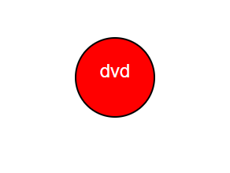
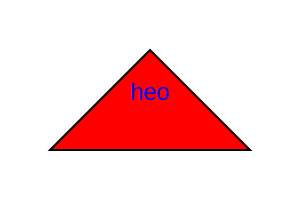
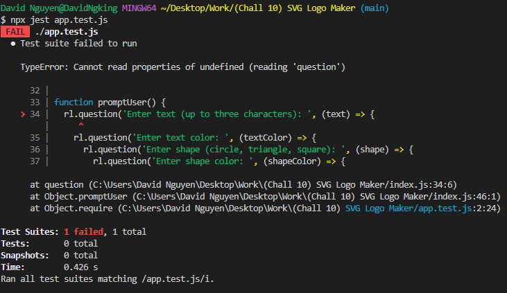

# 10: SVG Logo Maker

# My Task

This repo is about creating a svg Logo Generator using the power of Nodes/js.

This uses many npms like Jest and Requirer and requires learning
and reading on npm style coding.

To use the app.test, it is: npx jest app.test.js

to use the index, it is: node index.js

The app.test shows that there is one mistake, but that mistake does not effect the node code what so what
so ever, it basically can not read the rl.question (Cannot read properties of undefined (reading 'question'))

# Video on the Readme
<video controls>
  <source src="./Maddusk.mp4" type="video/mp4">
  Your browser does not support the video tag.
</video>

# Links for image and videos
This is the SVG



This is another example which will update each time you use the node index.js



Youtube Link

[Youtube video of how to activate it](https://youtu.be/uELK94k_VCA)

Screencastify Link

[Screencastify of how to activate it](https://watch.screencastify.com/v/dEFWtur5rvX6P5U7z856)

# This is the code what will show in terminal when running app.test



# Self made Challenge

```md
AS a freelance web developer
I WANT to generate a simple logo for my projects
SO THAT I don't have to pay a graphic designer
```

# Self made Criteria

```md
GIVEN a command-line application that accepts user input
WHEN I am prompted for text
THEN I can enter up to three characters
WHEN I am prompted for the text color
THEN I can enter a color keyword (OR a hexadecimal number)
WHEN I am prompted for a shape
THEN I am presented with a list of shapes to choose from: circle, triangle, and square
WHEN I am prompted for the shape's color
THEN I can enter a color keyword (OR a hexadecimal number)
WHEN I have entered input for all the prompts
THEN an SVG file is created named `logo.svg`
AND the output text "Generated logo.svg" is printed in the command line
WHEN I open the `logo.svg` file in a browser
THEN I am shown a 300x200 pixel image that matches the criteria I entered
```
